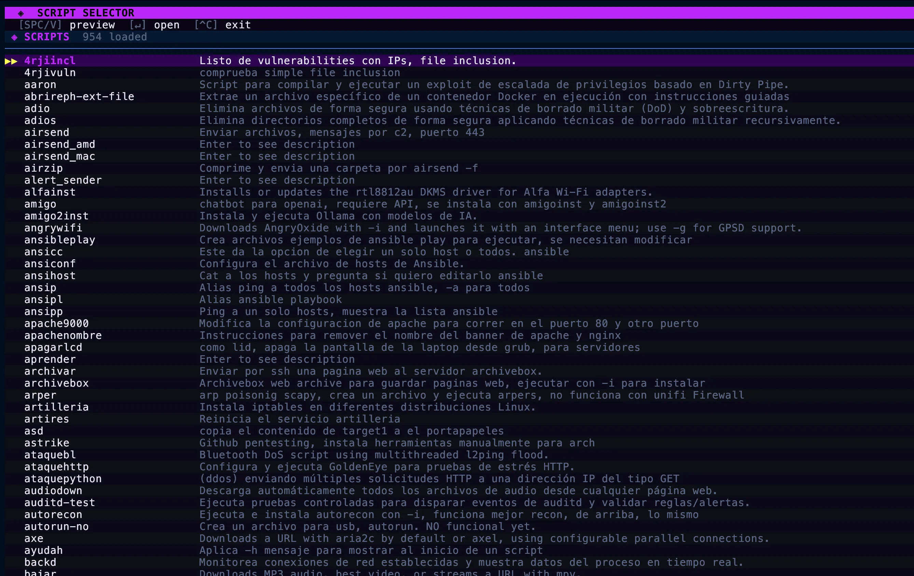

# Personal Script Collection

This repository is where I keep my personal scripts, command-line tools, notes, installers, helpers, and small utilities.

Most of the working files live in `binarios/`. That directory is intentionally kept mostly flat because the scripts are meant to be copied directly into a personal `$PATH` or installed into `/opt/4rji/bin/`.

## What Is Inside

- `binarios/`: the main collection of Bash, Python, Go, PowerShell, binaries, archives, and support files.
- `binarios/README.md`: the catalog of available scripts and their short descriptions.
- `binarios/static/`: static assets used by some scripts.
- `binarios/win-ps1-scripts/`: Windows PowerShell scripts.
- `binarios/discontinued/`: retired scripts kept for reference.

The scripts cover many personal workflows, including Linux administration, security labs, CCDC utilities, networking helpers, installers, automation shortcuts, file handling, and command references.

## Notes

This is a personal toolbox, not a packaged software project. There is no project-wide build system or test runner. Scripts are maintained individually and validated with the narrowest safe command for each change.
